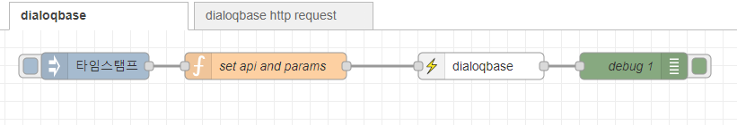
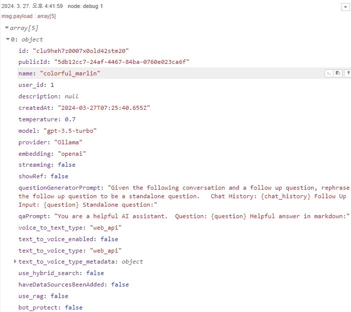

node-red-contrib-dialoqbase
================

Node-RED node for dialoqbase


## Install

To install the stable version use the `Menu - Manage palette - Install`
option and search for node-red-contrib-dialoqbase, or run the following
command in your Node-RED user directory, typically `~/.node-red`

    npm install node-red-contrib-dialoqbase

## Wrapper dialoqbase  API  
- https://github.com/n4ze3m/dialoqbase-js

## Sample parameters
```js
msg.api = 'bot';
msg.method = 'post' // get, post, put, delete, default:get
msg.params = {
    name: "Test Bot 2",
    model: "claude-3-opus-20240229",
    embedding: "nomic-ai/nomic-embed-text-v1.5"
}
return msg;
```

## Sample Flow
You can make this json string into a flow by using the node-red flow import function.

- [sample.json](examples/sample.json)





